## Neural Style Transfer - using TensorFlow 2.1  

  
TensorFlow 2.1 implementation for Leon A.Gatys neural style transfer algorithm

----
## Neural style transfer algorithm:  
Gaty's neural style transfer algorithm use VGG19 to extract feature space for both content image and style image. Content loss is computed by estimating mean squared error at content layer (`conv5_1`) between content and style image. Style loss is computed by computing Gram matrix at style layers (`conv5_1`,`conv4_1`,`conv3_1`,`conv2_1`). Total loss combined style loss and content loss with specific content weighting and style weighting. Style can be transfered by minimizing total loss.    
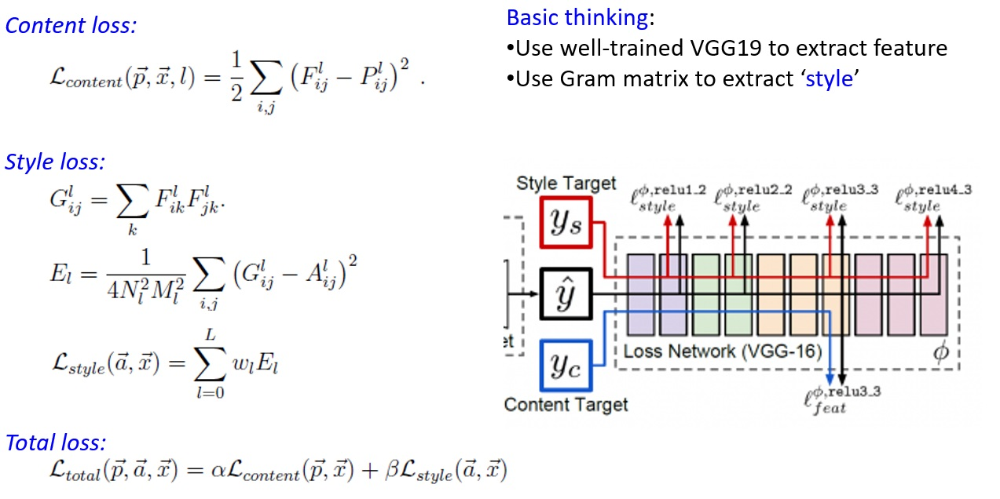  
  
Gram matrix is a kind of ***style*** estimation. In order to computer Gram matrix, the 3D feature space (H * W * C) is reshaped as 2D space (HW * C) first. Then, Gram matrix is derived by computing matrix multiplication (C * HW) * (HW * C). Size of Gram matrix is (nc * nc) where nc is number of channel for feature spaec. G(i,j) represents correlation between i_th feature and j_th feature. Therefore, style loss can be derived by computing mean square error between Gram matrix of style image and content image.  
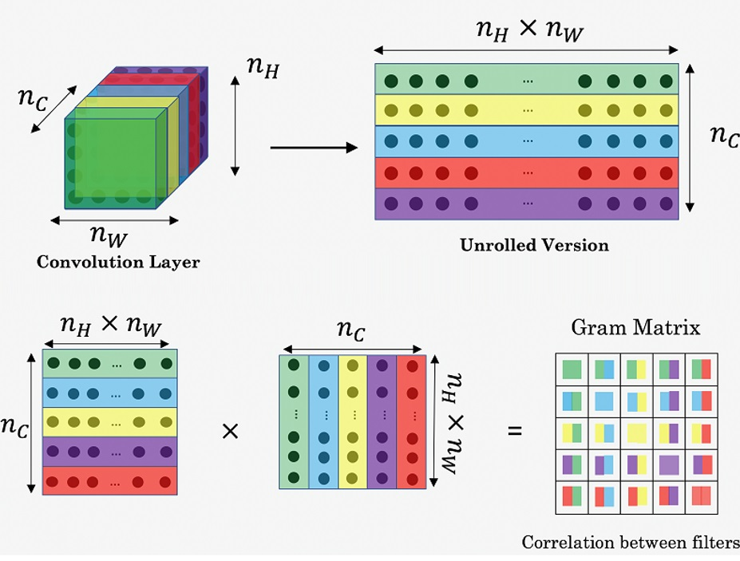  

----
## Reference
> **A Neural Algorithm of Artistic Style**  
> Leon A. Gatys, Alexander S. Ecker, Matthias Bethge  
> https://arxiv.org/abs/1508.06576  

> **Image Style Transfer Using Convolutional Neural Networks**  
> Leon A. Gatys, Alexander S. Ecker, Matthias Bethge  
> https://www.cv-foundation.org/openaccess/content_cvpr_2016/papers/Gatys_Image_Style_Transfer_CVPR_2016_paper.pdf

----
## Usage
Directly modify hyperparameters in the file named: `Gatys_Style_Transfer.py` and execute it.  
`S_path`  File path for style image  
`C_path`  File path for content image  
`S_weight` Weighting for style loss  
`C_weight` Weighting for content loss  
`TV_weight` Weighting for total variation loss  
`nrows` Number of rows for output image  
`S_layers` Feature layers for style loss
`C_layer` Feature layer for content loss

----
## Hyper Parameters
**Comparison between different dontent layer:**  
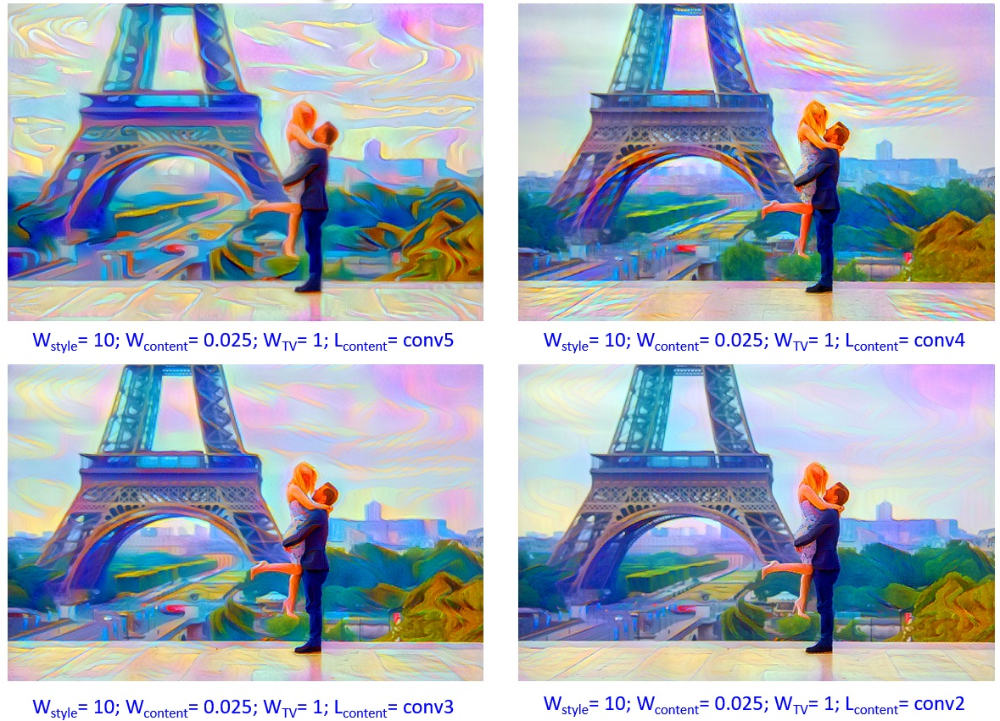  
  
**Comparison between different style weighting:**  
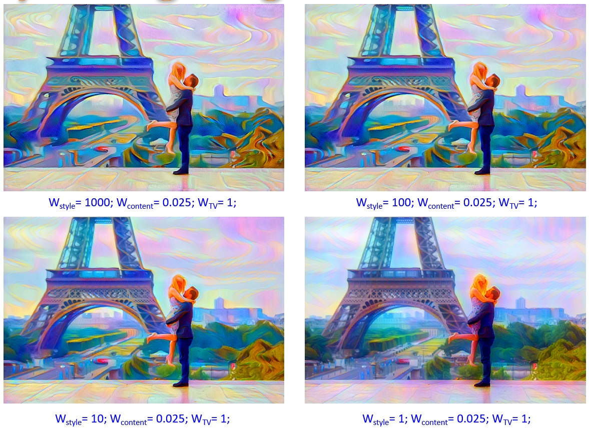  
  
**Comparison between different total variation weighting:**  
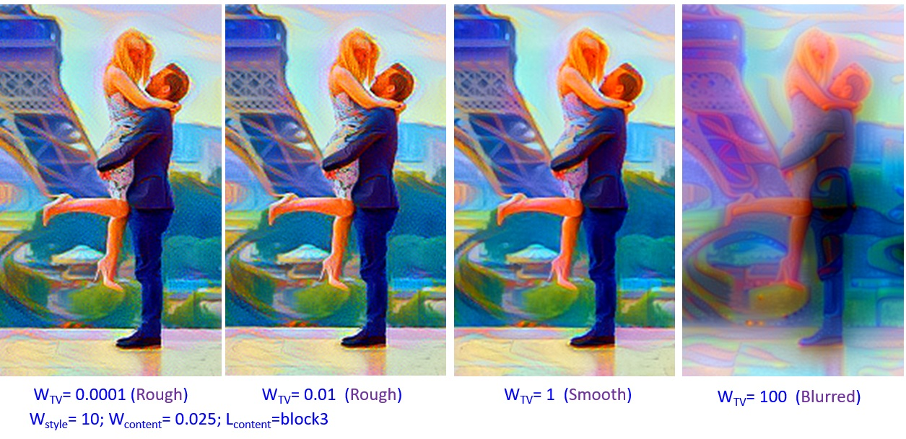  
  
----
## Style transfer results:  
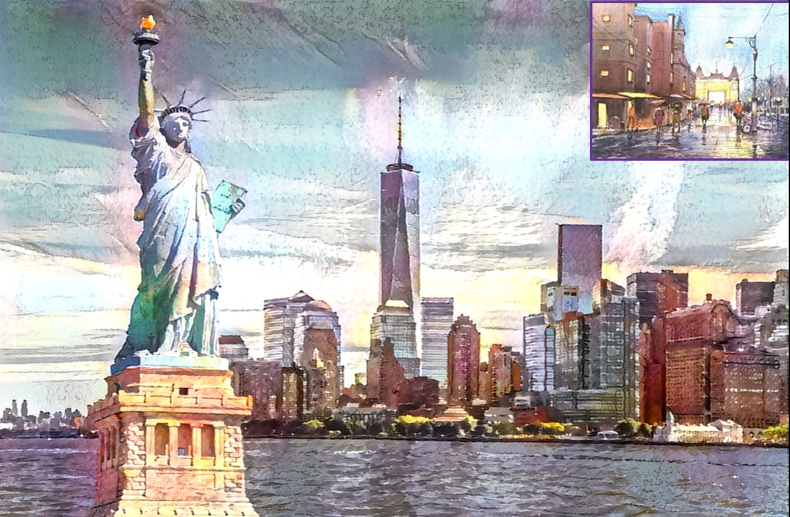  
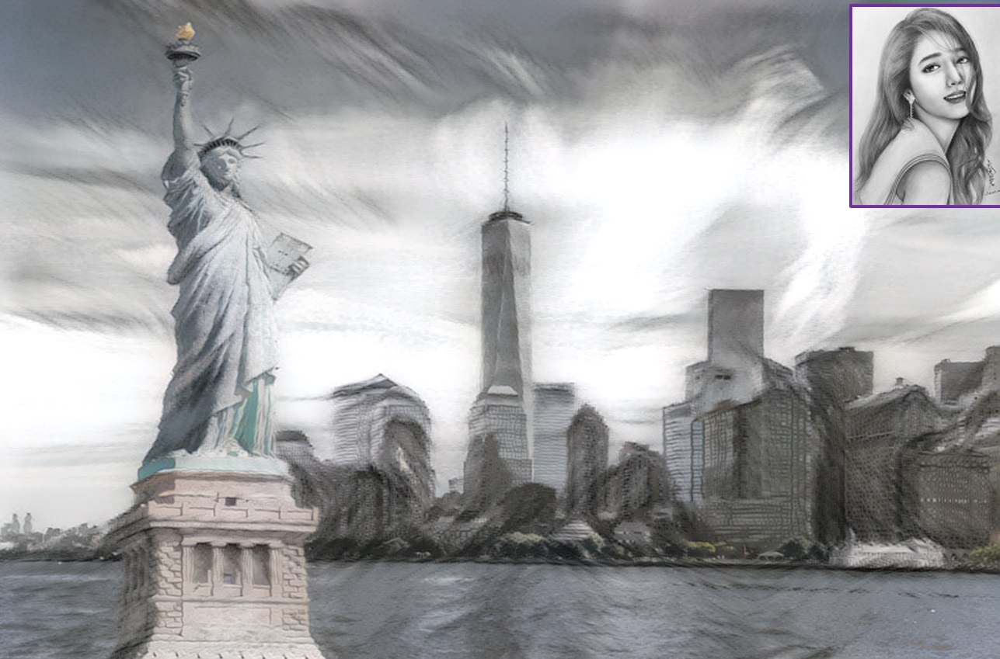  
  
  
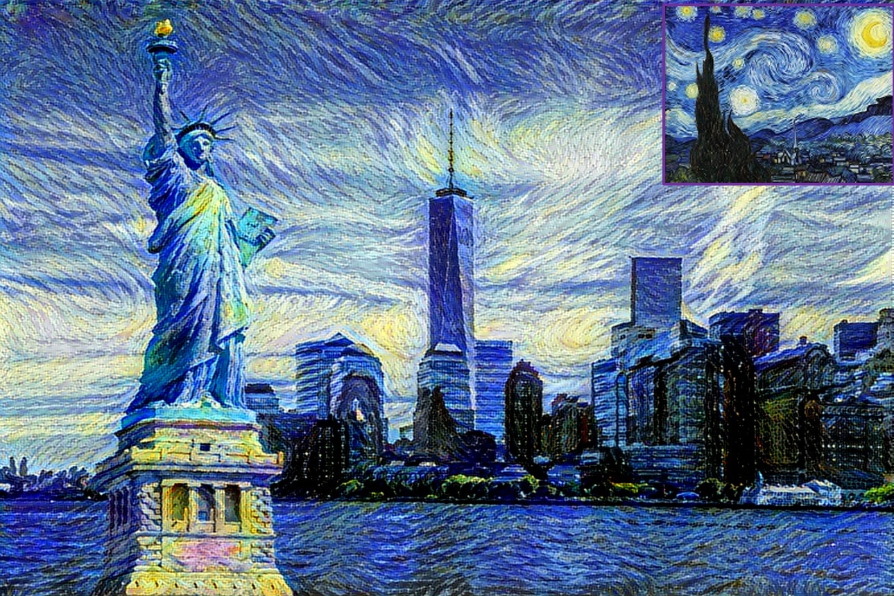  
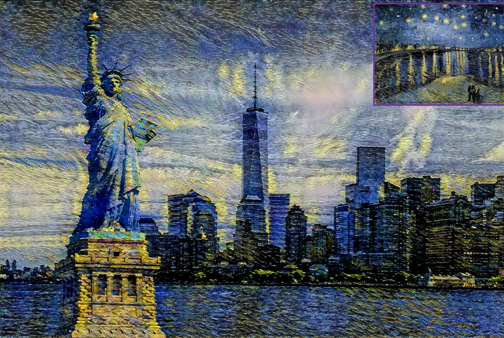  
  
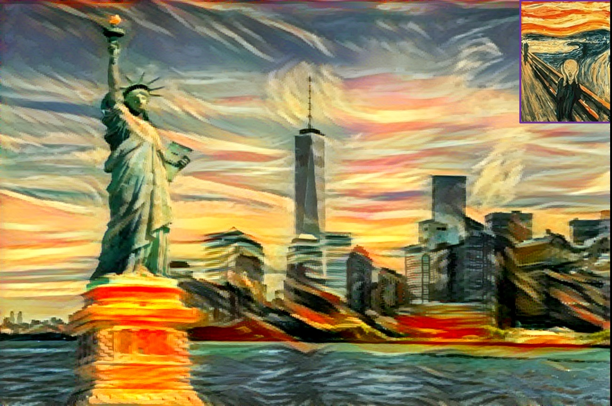  
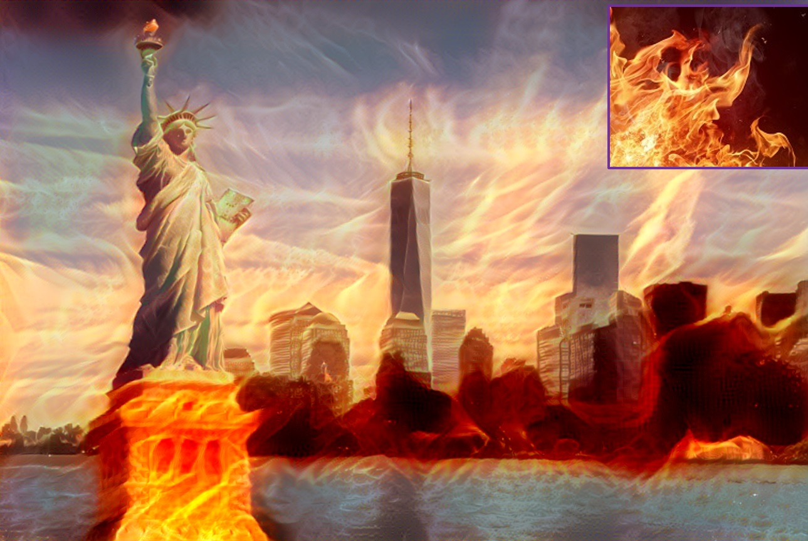  

